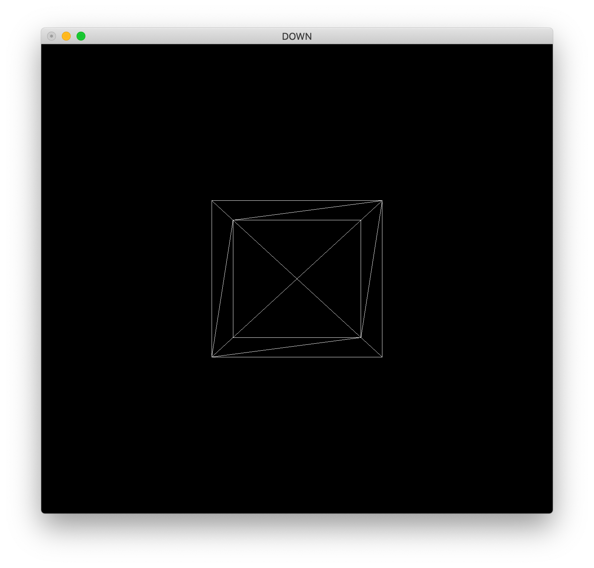
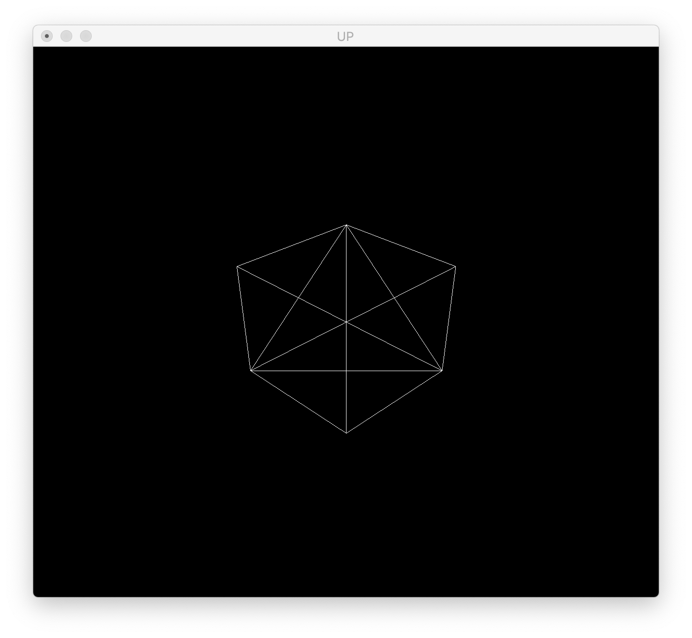

# Ray Tracer Challenge

This is a fun challange for building a simple ray tracer. We're going to build that step by step with instructions given by [@aslrousta](https://github.com/aslrousta/). I thank him for initiating this challenge. I add more steps as we go forward.

This project is written in C++ and OpenGL and is tested on macOS 10.15 (I haven't tested it on other OSs). I invented the wheel and wrote Vector and Matrix classes to refresh my C++ knowledge. To compile and run, just issue.

```
g++ -g -framework OpenGL -framework GLUT -o out main.cpp math.cpp
./out
```

## Step 1 Projection

In the first step, we project a 3d object onto a 2d screen. The vertices, faces, and cameras are in the file `model.txt`. You can read the [instructions of this step](instructions/assignment_en.pdf) for more details.





## Todo

- [ ] Get the camera index as the arguement.
- [ ] Add makefile.
